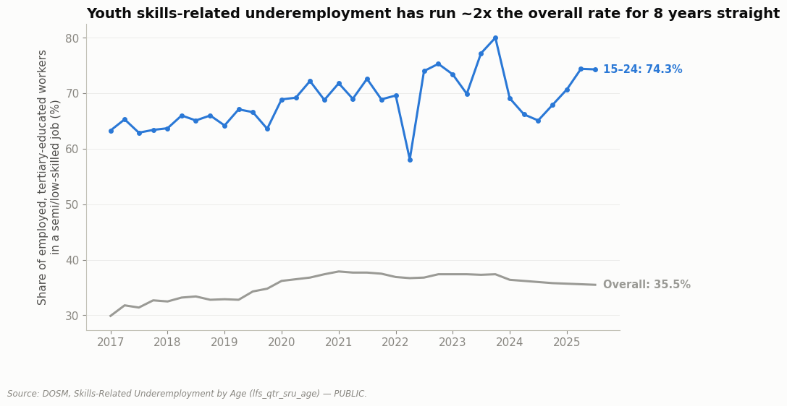

# Malaysia's Graduate (Un)employment: National, State, and District (2016–2026)



**Part of a [6-case-study portfolio](https://github.com/ooi-darren)** — see the other five.

## The Question

Malaysian commentary regularly describes a "graduate unemployment crisis." Does that framing survive contact with DOSM's own data — at the national level, across every one of Malaysia's 16 states, and down to individual districts? And if the headline rate doesn't show a crisis, where, if anywhere, does one actually show up?

## Status

✅ **Analysis complete.** Six notebooks, run as a funnel from national headline down to district-level granularity — deeper than any previous case study in this portfolio.

## Key Findings

**1. National: the headline rate shows no graduate-specific crisis at all.** Graduate unemployment was 3.4% in 2023 and 3.2% in 2024 — identical, in both years, to the national unemployment rate for everyone. *([Notebook 01](./notebooks/01-national-headline.ipynb))*

**2. Age: the real gap is about being young, not about having a degree.** Youth (15–24) unemployment has run 3–3.5x the national rate for a decade straight (10.2% most recently vs. ~3.0% national) — a fresh-labour-market-entrant problem that looks like a "graduate problem" only because most graduates are also young. *([Notebook 02](./notebooks/02-youth-cohort.ipynb))*
**Why:** Frictional job-search delay is normal for any labour market, but Khazanah Research Institute's own transition survey finds the delay is unusually long and unequal in Malaysia specifically. *(Full explanation in Notebook 02's "Why Is This Happening?" section.)*

**3. Job quality: this is where the real story is.** 74.3% of employed 15–24 year-olds with tertiary education are in a semi-skilled or low-skilled job — roughly double the 35.5% overall rate, and consistently 1.8–2.3x the overall rate in every quarter since 2017. Malaysia's graduate story is an underemployment story, not an unemployment one. *([Notebook 03](./notebooks/03-underemployment-reframe.ipynb))*
**Why:** Independent research ties this to a genuine field-of-study mismatch — oversupply concentrated in arts, social sciences, and general business, while technical and industrial fields report shortages. *(Full explanation in Notebook 03's "Why Is This Happening?" section.)*

**4. Geography: unemployment is highest in less-industrialised states — with one exception.** Sabah (5.7%), Labuan (4.7%), and Kelantan (4.6%) top the ranking as expected; industrial states like Selangor (1.8%) run well below. Kuala Lumpur (3.2%) is the outlier — Malaysia's wealthiest city, running *above* the national rate, breaking the pattern every other industrialised state follows. *([Notebook 04](./notebooks/04-every-state.ipynb))*

**5. Why states differ: manufacturing structure matters; local graduate supply doesn't.** Manufacturing-heavy states genuinely run lower unemployment. Local university density shows no relationship at all — Selangor has both the most public-university lecturers of any state *and* the lowest unemployment rate, directly against a "local oversupply" theory. Kuala Lumpur fits neither story cleanly. *([Notebook 05](./notebooks/05-why-states-differ.ipynb))*
**Why:** KL's smaller, more corporate-concentrated labour force is more exposed to the same absolute wave of layoffs that barely moves much-larger Selangor's rate. *(Full explanation in Notebook 05's "Why Is This Happening?" section.)*

**6. District: the state average badly understates the real hotspot.** 13 of the 15 highest-unemployment districts nationally are in Sabah's rural interior (8.7%–11.1%) — roughly double Sabah's own state average and 3–4x the national rate. Kuala Lumpur and Selangor don't appear near the top of the district ranking at all. *([Notebook 06](./notebooks/06-every-district.ipynb))*
**Why:** Independent reporting ties this to geographic isolation from Sabah's coastal economic core — interior roads remain unpaved despite years of development funding. *(Full explanation in Notebook 06's "Why Is This Happening?" section.)*

## Explain It Simply

People argue online that "a degree doesn't get you a job anymore" in Malaysia. This project checks that claim as literally as possible, using the government's own numbers, at three levels of zoom: the whole country, every state, and every district.

- **The whole country:** Are graduates more likely to be jobless than anyone else? *No — the rates are basically identical.*
- **But dig one level down, into age:** Is it really about being a *fresh* graduate specifically, not graduates in general? *Yes — young jobseekers (whether they have a degree or not) face unemployment roughly 3x higher than everyone else, for as long as this data goes back.*
- **And dig into job quality, not just "has a job or not":** Even when a young graduate *does* have a job, is it a job that actually needed a degree? *Often not — about 3 in 4 employed young people with a degree are in a job below their qualification level.*
- **Then zoom into geography, state by state:** Where in the country is the labour market weakest? *Mostly the less-industrialised states, as you'd expect — except Malaysia's own capital city, which is worse off than its wealth would suggest.*
- **And finally, district by district — the closest to "city" the data allows:** *One region stands out sharply: rural interior Sabah, where unemployment runs 2–4x the national rate, hidden inside a state average that looks only moderately elevated.*

Put together: there isn't one "graduate crisis." There's a youth-transition problem, a job-quality problem concentrated in certain fields, and a geographic-isolation problem in one specific part of the country — three different issues that get flattened into one headline. (New to terms like "underemployment" or "frictional unemployment"? See the [Glossary](#glossary) near the bottom.)

## Why This Project

Most commentary about "graduate unemployment" in Malaysia cites the phrase as settled fact and stops there. This project tests it directly against DOSM's own published data, at three levels of geographic granularity most commentary never checks — national, every state, and every district — and reports exactly where the popular narrative holds, where it needs a sharper reframe, and where the data can go no further (there is no published city-level series in Malaysia; district is the floor).

## Data Sources

Every dataset is labeled **PUBLIC** (fetched and read directly from an official source), **DERIVED** (built by this session from a PUBLIC source), or **ESTIMATED** (secondary-cited, not independently verified against a primary document). Full definitions and known limitations — including a real column-mapping data-quality issue found and corrected in the youth-unemployment series — are documented in [`DATA_DICTIONARY.md`](./DATA_DICTIONARY.md); full citations in [`references/SOURCES.md`](./references/SOURCES.md).

| Dataset | Source | Classification | Coverage |
|---|---|---|---|
| National unemployment, long run | DOSM, Labour Force Survey | PUBLIC | 1982–2023 |
| Graduate vs. national unemployment | DOSM, Graduates Statistics 2024 | DERIVED/ESTIMATED | 2023–2024 |
| Youth unemployment | DOSM, Monthly Youth Unemployment | PUBLIC (corrected) | 2016–2026 |
| Skills-related underemployment | DOSM, Labour Force Survey | PUBLIC | 2017–2025 |
| State unemployment | DOSM, Labour Force Survey by State | PUBLIC | 2017–2025 |
| State GDP by sector | DOSM, State GDP | DERIVED | 2024 |
| Public university lecturers by state | DOSM | DERIVED | 2023 |
| District unemployment | DOSM, Labour Force Survey by District | PUBLIC | 2024 |

**Data quality is uneven by design of the topic, stated plainly rather than smoothed over:** the national and state series are clean structured time series from DOSM's Labour Force Survey; the graduate-specific figures had to be sourced from a PDF this session's tools couldn't machine-read; and a genuine header/data mismatch was found and corrected in the youth-unemployment file — see `DATA_DICTIONARY.md` for the full verification.

## Notebooks

| # | Question | Data Rigor |
|---|---|---|
| [01 — National Headline](./notebooks/01-national-headline.ipynb) | Does the "graduate crisis" narrative hold at face value? | DERIVED/ESTIMATED + PUBLIC |
| [02 — Youth Cohort](./notebooks/02-youth-cohort.ipynb) | Is it really an age problem, not a degree problem? | PUBLIC |
| [03 — Underemployment Reframe](./notebooks/03-underemployment-reframe.ipynb) | Even when employed, are graduates in the right kind of job? | PUBLIC |
| [04 — Every State](./notebooks/04-every-state.ipynb) | Where in Malaysia is the labour market actually weakest? | PUBLIC |
| [05 — Why States Differ](./notebooks/05-why-states-differ.ipynb) | Does industrial structure or local graduate supply explain it? | PUBLIC + DERIVED |
| [06 — Every District](./notebooks/06-every-district.ipynb) | Do hotspots cluster where you'd expect, or surprise? | PUBLIC |

## Methodology

Business problem → objectives → data acquisition → cleaning → analysis → visualization → insight → recommendation, run once per layer of the funnel — national, age, job quality, state, structural explanation, then district. Each notebook opens with the question and the answer, then shows the reasoning between them, including a genuine data-quality bug found and corrected mid-analysis (see `DATA_DICTIONARY.md`) and two notebooks where the first-draft finding didn't survive contact with the actual chart and had to be rewritten to match the data, not the other way around.

## Reproducing This Analysis

```bash
pip install -r requirements.txt
jupyter notebook notebooks/
```

All data used is already included in `data/processed/` — notebooks read directly from there, so no external downloads are required to re-run the analysis.

## Repository Structure

```
data/
├── raw/          # Original files, unmodified, as downloaded from source
└── processed/    # Cleaned/compiled datasets ready for analysis
notebooks/        # Analysis notebooks
references/       # Source citations (SOURCES.md)
DATA_DICTIONARY.md
```

## Glossary

Plain-language definitions for the technical terms used in this project.

- **Underemployment (skills-related):** Having a job, but one that doesn't actually require your level of education — for example, a university graduate working a job that only needs a high-school diploma.
- **Frictional unemployment:** The normal, unavoidable delay between finishing school (or leaving a job) and finding the next one — job search itself takes time, even in a healthy economy.
- **GLFPR (Graduate Labour Force Participation Rate):** The share of graduates who are either working or actively looking for work, as opposed to being out of the labour force entirely (e.g. further study, caregiving).
- **District:** Malaysia's finest published geographic unit for labour statistics — smaller than a state, but larger than (and not the same as) a city. There is no separate city-level labour data published in Malaysia.
- **PUBLIC / DERIVED / ESTIMATED:** How traceable a number in this project is. **PUBLIC** = taken directly from an official source. **DERIVED** = built by combining or calculating from official sources by hand. **ESTIMATED** = based on a secondary source that couldn't be independently verified. See [`DATA_DICTIONARY.md`](./DATA_DICTIONARY.md) for exactly how every number here was classified.

## Author

Darren Ooi — [LinkedIn](https://www.linkedin.com/in/darrenooizhixian)
